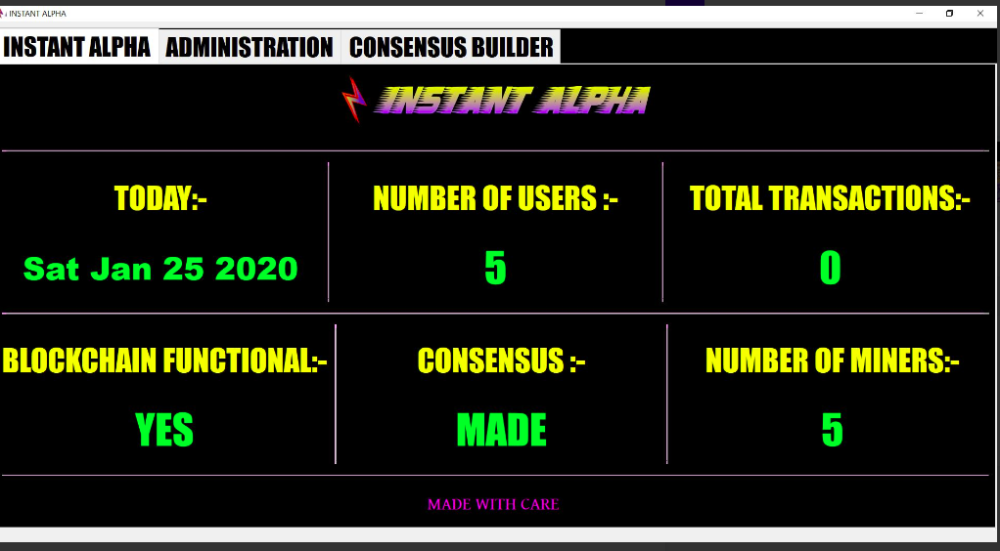
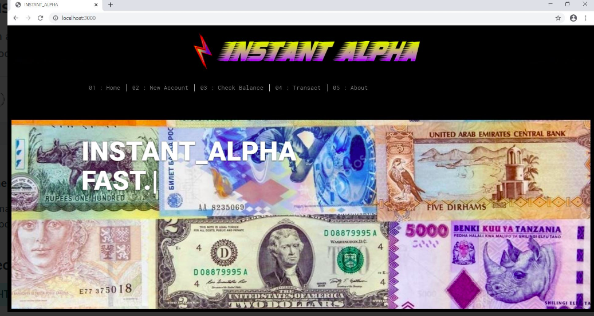

## INSTANT_ALPHA 
BlockChain using Node.js and C++

The application simulates currency transactions backing them up with a fully functioning Block Chain.
The server application is made from QT Framework and its associated libraries in C++ while the networking is handeled by Node.js and Express.js.This application especially supports mining and consensus building as they are the essential parts of any large scale BlockChain.

Monitoring Application: -

Client Application:-

